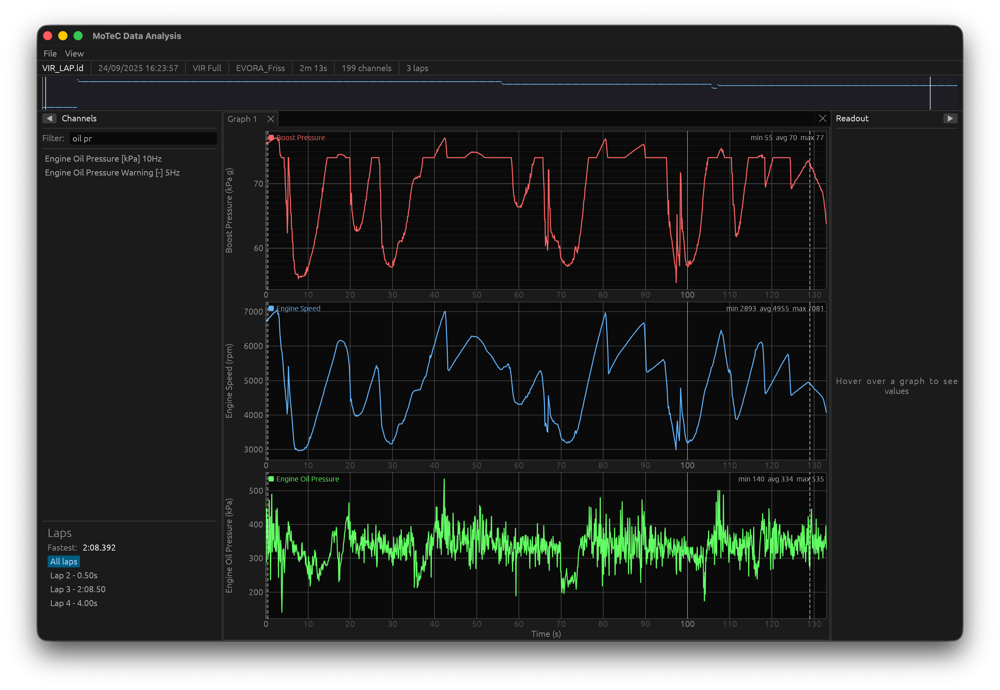

# i3rs

An open-source, cross-platform alternative to MoTeC i2 Pro for motorsport telemetry analysis. Built entirely in Rust.

i3rs opens MoTeC `.ld` log files and provides time-series graphs, lap navigation, multi-panel workspaces, and cursor-synchronized analysis -- all in a single native binary with no runtime dependencies.



## Features

- **MoTeC .ld/.ldx parsing** -- reads the binary log format produced by MoTeC M1 ECUs, including channel metadata, sample data, and lap timing from `.ldx` sidecar files
- **Memory-mapped file access** -- opens 100MB+ files instantly via `memmap2`; channel data is decoded on demand
- **Min-max decimation** -- renders 200+ channels at 60fps by downsampling to pixel resolution while preserving visual peaks and valleys
- **Multi-channel graphs** -- overlay or tiled modes, dual Y-axes, color-coded lines, drag-and-drop channels
- **Lap detection & navigation** -- parses lap boundaries from data or `.ldx` files, lap markers on the timeline, click-to-zoom
- **Dockable panel layout** -- multiple graph panels, channel browser, cursor readout, and timeline overview in a resizable tabbed workspace
- **Cross-panel synchronization** -- cursor position and zoom range stay in sync across all panels
- **Workspace persistence** -- save and load panel layouts to JSON; multiple worksheet tabs
- **Cross-platform** -- runs on macOS, Windows, and Linux via `wgpu` backends (Vulkan/Metal/DX12/OpenGL)

## Building

Requires Rust 2024 edition (rustc 1.85+).

```bash
cargo build --release
```

## Usage

### GUI Application

```bash
# Open with file picker
cargo run --release -p i3rs-app

# Open a specific file
cargo run --release -p i3rs-app -- path/to/session.ld
```

You can also drag and drop `.ld` files onto the application window.

### CLI

Print session metadata and channel statistics (min/max/mean) for a log file:

```bash
cargo run --release -p i3rs-cli -- path/to/session.ld
```

## Project Structure

```
crates/
  i3rs-core/    Core library: .ld/.ldx parsing, data model, lap detection, downsampling
  i3rs-app/     Desktop GUI application (egui + egui-dock)
  i3rs-cli/     Command-line file inspector
docs/
  PLAN.md           Development roadmap (Milestones 1-9)
  ld-file-format.md MoTeC .ld binary format specification
test_data/
  VIR_LAP.ld        Sample telemetry log (~4.8MB, single lap at Virginia International Raceway)
  VIR_LAP.ldx       Associated lap metadata (XML sidecar)
```

### Key Dependencies

| Crate | Purpose |
|-------|---------|
| `memmap2` | Zero-copy memory-mapped file access |
| `half` | IEEE 754 float16 decoding |
| `eframe` / `egui` | Immediate-mode GUI framework |
| `egui_plot` | Line chart rendering with pan/zoom |
| `egui-dock` | Dockable, tabbable panel layout |
| `quick-xml` | `.ldx` sidecar XML parsing |
| `rfd` | Native file open dialogs |

## Test Data

The `test_data/` directory contains a small sample dataset for development and testing:

- **`VIR_LAP.ld`** -- a single-lap telemetry recording from Virginia International Raceway (~4.8MB)
- **`VIR_LAP.ldx`** -- the accompanying XML sidecar with lap timing data

These files are produced by a MoTeC M1 ECU and exercise the full parsing pipeline: header, event/venue/vehicle metadata, channel metadata linked list, and multi-type sample data.

## Roadmap

See [`docs/PLAN.md`](docs/PLAN.md) for the initial roadmap.


## License

MIT
