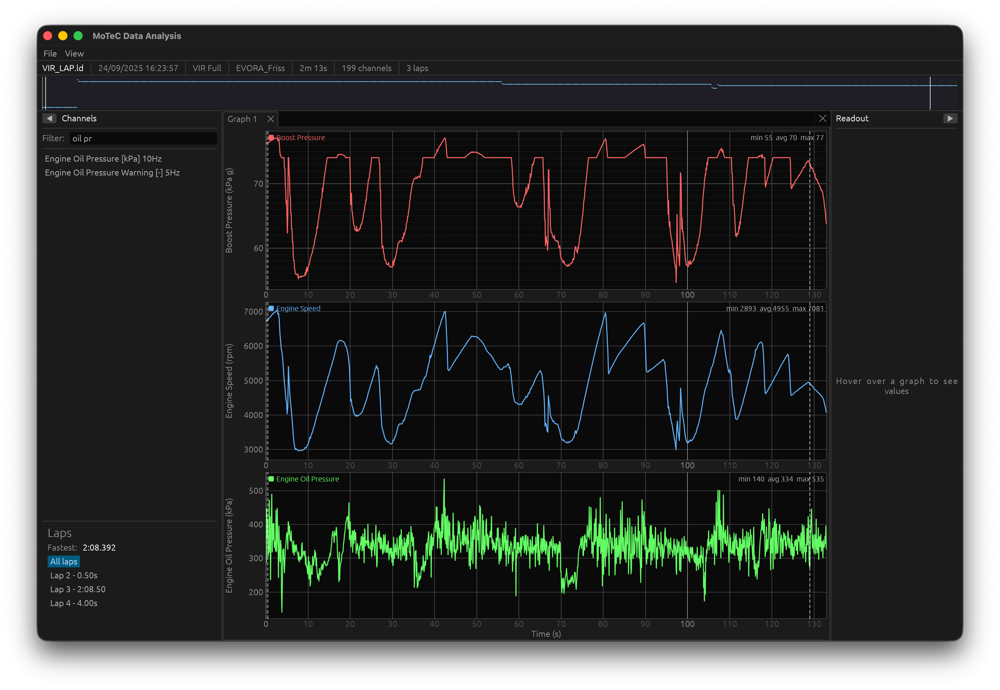

# i3rs

An open-source, cross-platform alternative to MoTeC i2 Pro for motorsport telemetry analysis. Built entirely in Rust.

i3rs opens MoTeC `.ld` log files and provides time-series graphs, lap navigation, multi-panel workspaces, and cursor-synchronized analysis -- all in a single native binary with no runtime dependencies.



## Features

- **MoTeC .ld/.ldx parsing** -- reads the binary log format produced by MoTeC M1 ECUs, including channel metadata, sample data, and lap timing from `.ldx` sidecar files
- **Memory-mapped file access** -- opens 100MB+ files instantly via `memmap2`; channel data is decoded on demand
- **Min-max decimation** -- renders 200+ channels at 60fps by downsampling to pixel resolution while preserving visual peaks and valleys
- **Multi-channel graphs** -- overlay or tiled modes, dual Y-axes, color-coded lines, drag-and-drop channels
- **Lap detection & navigation** -- parses lap boundaries from data or `.ldx` files, lap markers on the timeline, click-to-zoom
- **Dockable panel layout** -- multiple graph panels, channel browser, cursor readout, and timeline overview in a resizable tabbed workspace
- **Cross-panel synchronization** -- cursor position and zoom range stay in sync across all panels
- **Workspace + project persistence** -- save reusable race-weekend project files with session lists, math channels, overlays, and worksheet layouts
- **Global channel preferences** -- reuse preferred colors and display units across sessions and projects
- **Session comparison + themes** -- inspect session metadata side by side and switch between light, dark, and high-contrast themes
- **Cross-platform** -- runs on macOS, Windows, and Linux via `wgpu` backends (Vulkan/Metal/DX12/OpenGL)
- **Packaging scaffold** -- repository-managed `cargo-packager` config for macOS `.dmg`, Linux `.AppImage`, and Windows `.msi` builds

## Building

Requires Rust 2024 edition (rustc 1.85+).

```bash
cargo build --release
```

## Packaging

i3rs now includes a checked-in `cargo-packager` configuration for release artifacts.

```bash
cargo install cargo-packager --locked
cd crates/i3rs-app
cargo packager --release --formats appimage
```

Use platform-native formats on each OS:

- macOS: `cargo packager --release --formats app dmg`
- Linux: `cargo packager --release --formats appimage`
- Windows: `cargo packager --release --formats wix`

More detail is in [`docs/packaging.md`](docs/packaging.md).

## Releasing

PRs are verified in GitHub Actions with linting, tests, a crates.io dry run for `i3rs-core`, and cross-platform builds.
PRs also verify that the web/wasm bundle builds successfully with Trunk.
Pushes to `main` are scaffolded to publish `i3rs-core` and `i3rs-cli` to crates.io when the workspace version is new, and separately package desktop/web artifacts into a GitHub release when the app package version in [`crates/i3rs-app/Packager.toml`](crates/i3rs-app/Packager.toml) is new.

Release details and required secrets are documented in [`docs/releasing.md`](docs/releasing.md).

## Usage

### GUI Application

```bash
# Open with file picker
cargo run --release -p i3rs-app

# Open a specific file
cargo run --release -p i3rs-app -- path/to/session.ld
```

You can also drag and drop `.ld` files onto the application window.

Use `File > Save Project...` to capture the current worksheet layout, math channels, and referenced `.ld` sessions into a reusable `.i3rsproj` file.
Use `View > Session Details` to compare the current run against another project session, and right-click plotted channels to save global color/unit defaults.

### Web / Wasm

Build the web bundle with Trunk:

```bash
rustup target add wasm32-unknown-unknown
cargo install trunk --locked
cd crates/i3rs-app
trunk build --release
```

The generated bundle is written to `crates/i3rs-app/dist/`.
The release workflow also publishes this bundle as a GitHub release asset named `i3rs-web.tar.gz`.

### CLI

Print the legacy text summary for a log file:

```bash
cargo run --release -p i3rs-cli -- path/to/session.ld
```

When installed, the executable is named `i3rs`; the examples below use
`cargo run` for source-tree development.

The CLI also exposes machine-readable commands for agentic/session analysis:

```bash
# Session metadata, channels, and lap windows
cargo run --release -p i3rs-cli -- summary path/to/session.ld --format json
cargo run --release -p i3rs-cli -- channels path/to/session.ld --filter speed --format json
cargo run --release -p i3rs-cli -- laps path/to/session.ld --format json

# Extract how values change through a lap instead of relying only on min/max
cargo run --release -p i3rs-cli -- extract path/to/session.ld \
  --channel "Engine Speed" --channel "Throttle Position" \
  --lap "Lap 1" --x lap-percent --resample points:200 --format csv

# Per-lap statistics and lap-to-lap comparison
cargo run --release -p i3rs-cli -- stats path/to/session.ld \
  --channel "Engine Speed" --group lap --format json
cargo run --release -p i3rs-cli -- compare-laps path/to/session.ld \
  --channel "Engine Speed" --laps "Lap 1,Lap 2" \
  --reference "Lap 1" --x lap-percent --resample points:200 --format json
```

See [`docs/cli-analysis.md`](docs/cli-analysis.md) for command output shapes and the repeatable `run` spec format.

Show CLI help or install agent skill files for the CLI:

```bash
cargo run --release -p i3rs-cli -- help
cargo run --release -p i3rs-cli -- install-skill
```

`install-skill` writes `$CWD/.agents/skills/i3rs/SKILL.md` and `$CWD/.claude/skills/i3rs/SKILL.md`.

## Project Structure

```
crates/
  i3rs-core/    Core library: .ld/.ldx parsing, data model, lap detection, downsampling
  i3rs-app/     Desktop GUI application (egui + egui-dock)
  i3rs-cli/     Command-line file inspector
docs/
  PLAN.md           Development roadmap (Milestones 1-9)
  cli-analysis.md   Machine-readable CLI command reference
  ld-file-format.md MoTeC .ld binary format specification
test_data/
  VIR_LAP.ld        Sample telemetry log (~4.8MB, single lap at Virginia International Raceway)
  VIR_LAP.ldx       Associated lap metadata (XML sidecar)
```

### Key Dependencies

| Crate | Purpose |
|-------|---------|
| `memmap2` | Zero-copy memory-mapped file access |
| `half` | IEEE 754 float16 decoding |
| `eframe` / `egui` | Immediate-mode GUI framework |
| `egui_plot` | Line chart rendering with pan/zoom |
| `egui-dock` | Dockable, tabbable panel layout |
| `quick-xml` | `.ldx` sidecar XML parsing |
| `rfd` | Native file open dialogs |

## Test Data

The `test_data/` directory contains a small sample dataset for development and testing:

- **`VIR_LAP.ld`** -- a single-lap telemetry recording from Virginia International Raceway (~4.8MB)
- **`VIR_LAP.ldx`** -- the accompanying XML sidecar with lap timing data

These files are produced by a MoTeC M1 ECU and exercise the full parsing pipeline: header, event/venue/vehicle metadata, channel metadata linked list, and multi-type sample data.

## Roadmap

See [`docs/PLAN.md`](docs/PLAN.md) for the initial roadmap.


## License

MIT
